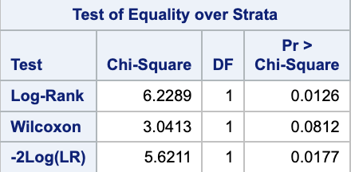
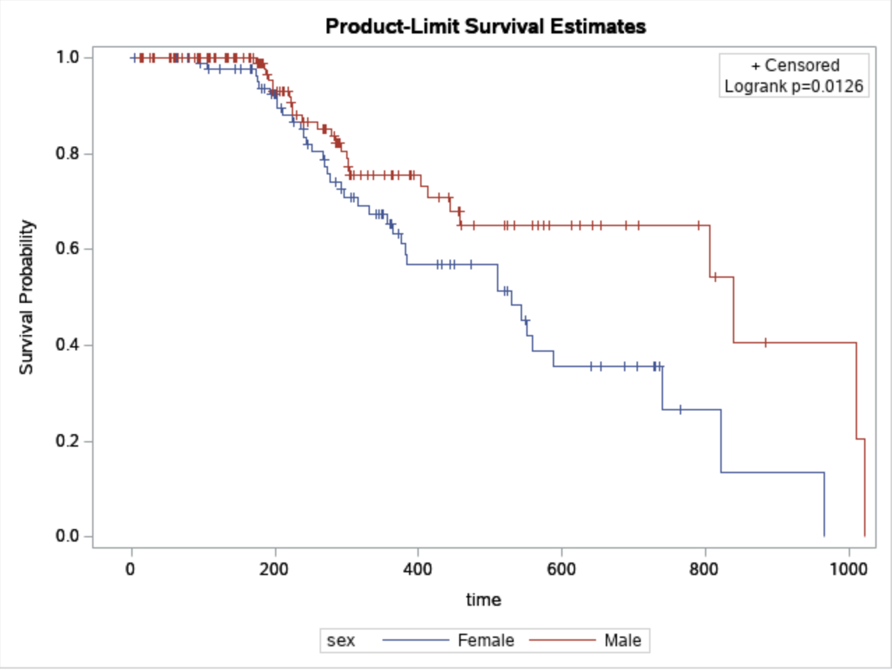
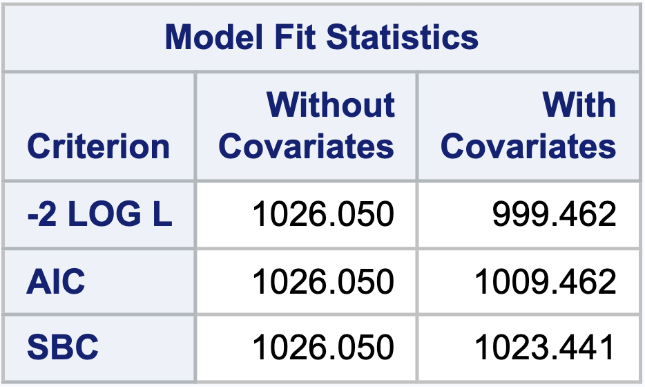
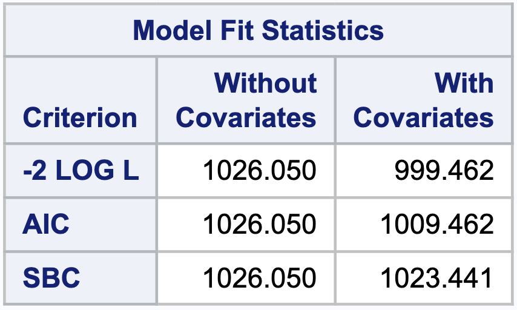
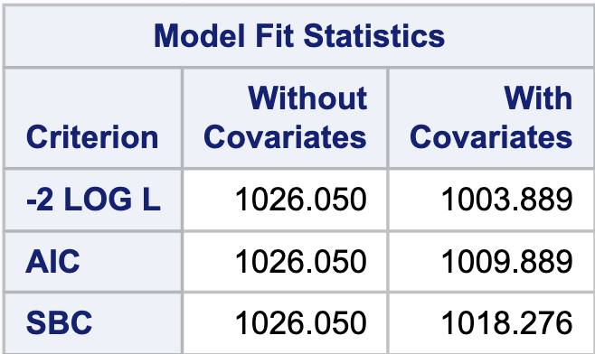
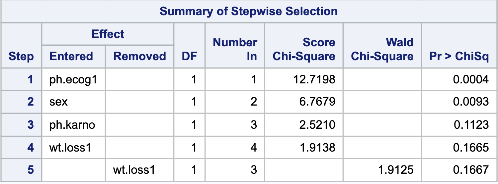
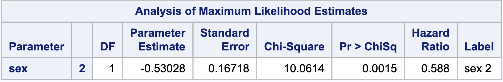

```{r setup, include=FALSE}
library(tidyverse)
library(survival)
library(gtsummary)
library(survminer)

knitr::opts_chunk$set(
  echo = FALSE,
  message = FALSE,
  warning = FALSE,
  fig.pos = "H")
```

# Introduction

Lung cancer is a disease with a very high prevalence. Prognostic factors provide important information for patients with cancer. A better understanding of patients’ prognosis can help in making appropriate therapeutic decisions[1]. Driven by the desire to improve life quality of lung cancer patients, we perform a survival analysis of these patients and analyze factors that affect survival time.

The dataset we use is the lung cancer dataset in ‘survival’ package in R. The data describes survival of patients with advanced lung cancer from the North Central Cancer Treatment Group, as well as measures of the patients performance assessed either by the physician and by the patients themselves[1]. Our project aims to explore whether factors such as age, sex, and caloric intake, will bring significant differences in the survival rate of patients with advanced lung cancer. The association between both the physician’s assessments of performance status as well as the patient’s assessment of their own performance status and the survival rate are also evaluated.

Methods we use in this project include exploratory data analysis, non-parametric estimate, hypothesis testing, semi-parametric model and parametric models. Details of those methods are given below.

# Methods

## Exploratory Data Analysis

The dataset contains a total of 228 patients and 10 variables. A brief description of variables in the dataset is shown below.

* inst:	Institution code
* time:	Survival time in days
* status:	Censoring status(1=censored, 2=dead)
* age:	Age in years
* sex:	Male=1, Female=2
* ph.ecog:	ECOG performance score (0=good 5=dead)
* ph.karno:	Karnofsky performance score (from bad=0 to good=100) rated by physician
* pat.karno:	Karnofsky performance score as rated by patient
* meal.cal:	Calories consumed at meals
* wt.loss:	Weight loss in last six months

Survival endpoint is the death of patients. The type of censoring is right censoring, which means patients left the study before their death. Among 228 patients, 63 of them were right censored and the number of events was 165. We group the patients by their survival status and provide the descriptive statistics of other variables. Wilcoxon rank sum test, Pearson's Chi-squared test, and Fisher's exact test were used to compare values across group. 

```{r}
data <- lung


data$status <- factor(data$status,
                      levels = c(1,2),
                      labels = c("Alive", "Death"))
data$sex <- factor(data$sex,
                   levels = c(1,2),
                   labels = c("Male", "Female"))
data$ph.ecog <- factor(data$ph.ecog,
                       levels = c(0,1,2,3))
data$ph.karno <- factor(data$ph.karno,
                       levels = c(50,60,70,80,90,100))
data$pat.karno <- factor(data$pat.karno,
                         levels = c(30,40,50,60,70,80,90,100))


data %>% 
  select(-1) %>%
  tbl_summary(by = status,
              statistic = list(all_continuous() ~ "{mean} ({sd})",
                               all_categorical() ~  "{n} ({p}%)"),
              label = list(time ~ "Survival Time (days)", 
                           age~"Age",
                           sex~"Sex",
                           ph.ecog~ "ECOG Score",
                           ph.karno~"Karnofsky Score(by physician)",
                           pat.karno~"Karnofsky Score(by patients)",
                           meal.cal~"Calories Consumed (kcals)",
                           wt.loss~"Weight Loss (pounds)"),
              missing_text = "Missing") %>% 
  add_p(list(all_categorical() ~ "fisher.test"),
    test.args = pat.karno ~ list(workspace=2e9)) %>%
  add_overall() %>%
  modify_header(label ~ "**Variable**") %>%
  modify_caption("**Table 1: Patient Characteristics**") %>%
  bold_labels()
```

From the table, we can see that average survival time for censored and dead patients is 363 days and 283 days, respectively. From the p values, we can see that for patients who were alive and dead, the survival time, sex proportion, ECOG performance score and Karnofsky performance score rated by patient are significantly different. However, there are no significant differences in age, Karnofsky performance score rated by physician, calories consumed, and weight loss. (Note that the p values for all continuous variables are obtained from Wilcoxon rank sum tests while Fisher's exact tests for the categorical.)

From the table we can see that there are some missing values in this dataset. For simplicity, we removed those missing data for the following analysis.


## Non-parametric Estimate

**Lifetable** The lifetable was constructed using standard life table methodology[2]. Table 2 represents the lifetable with the time break of 100 days stratified by sex. The full table was in supplementary material. Based on the lifetable, the 50\% survival time of male is between 285 to 286 days versus 433-434 for female. Male has lower survival time than female based on lifetable. The hypothesis need future testify in the following modeling fitting.

<center>


</center>

<center>


</center>

**The Kaplan-Meier and Fleming-Harrington model** For nonparametric estimator, Kaplan-Meier (KM) model and Fleming-Harrington (FH) model were used to measure the fraction of subjects living for a certain amount of time after treatment with the stratify of sex[3].  

  * The Kaplan-Meier estimator

$$ 
\hat S_K(t)= \begin{cases}
1 & \text { if } t< t_1  \\ 
\prod_{t_i \le t} [1-\frac{d_i}{n_i}] & \text { if }   t \ge t_1
\end{cases}
$$

note: $d_i = \# \ of\ failure \ at \ time\ t_i$, $n_i = \#\ at\ risk \ at \  t_i^-$,  $c_i = \# \ censored\ during\ the\ interval\ [t_i, t_{i+1}]$  

  * The Fleming-Harrington estimator

$$ 
\hat S_F(t)= \begin{cases}
1 & \text { if } t< t_1  \\ 
\prod_{t_i \le t} exp[-\frac{d_i}{n_i}] & \text { if }   t \ge t_1
\end{cases}
$$
Both the KM estimator and the FH estimator have P-values that are lower than 0.05. We have 95\% confidence that there are differences between the survival curves over the male and female. According to the following graph(Figure 1), male have a lesser chance of living through the 3 years than female. The difference between sex is more significant in the early time point than the later time point. 

<center>


The KM and FH model have similar trend with no significant difference. FH has slight higher estimator in the late time point than KM estimator.


## Hypothesis Testing
**Log-Rank test and Wilcoxon test** Non-parametric test was conducted to compare the survival experience between males and females, using Log-Rank test and Wilcoxon test (Table 3). However, according to the SAS output, inconsistent results were generated. The Log-Rank test gave us a test statistic of 6.23 with a p-value of 0.01. Thus, we will reject the null hypothesis and conclude that there is a significant difference in survival experience between males and females. However, when we move on to use the Wilcoxon test, chi-square statistic is 3.04, with its associated p-value 0.08. We thus fail to reject the null hypothesis and conclude that there is no significant difference between two sex groups. The underlying reason behind this discrepancy is due to the fact that the Wilcoxon test is more sensitive to detect early points in time than the Log-Rank test.

**Survival Curve** By looking at survival curves for males and females (Figure 2), apparently in the earlier point in time, there is no obvious difference in survival probability between males and females. Nevertheless, for the later point in time,the gap starts getting larger. This gap explains why we got a non-significant result from the Wilcoxon test: it has more weights to detect earlier time that has no significant difference.

<center>
{width=50%}

</center>

<center>

{width=90%}

</center>

## Semi-parametric Model (PH model)


### Variable Selection and Stratification

In order to find the varaibles of central interest on the outcome, we applied three variable selection models here, backward elimination selection, stepwise selection and forward selection models. There are two ways of scoring a model based on its log-likelihood and complexity returned by PROC PHREG function in SAS here, Akaike Information Criterion (AIC) and Schwartz's Bayesian Criterion (SBC) (which is commonly known as the Bayesian Information Criterion (BIC)). As it is indicated in the figures below, the stepwise selection model comes with the AIC of 1009.889 with covariates (Table 6). Both the forward selection (Table 4) and backward selection model (Table 5) returned the AIC of 1009.462, which is pretty close to the value in stepwise. To develop the most appropriate model, we move on to compare the SBC indexes in three models. Both forward selection and backward selection model have SBC value of 1023.441 while the stepwise selection model have SBC value of 1018.276. Therefore, we determine to set up the results of utilize the stepwise selection as the final model. 

<center>

{width=50%}

</center>

<center>

{width=50%}

</center>

<center>

{width=50%}

</center>

In the stepwise selection model, we set up the level of entry as 0.25 and the level of stay of 0.15 based on the common use. It turns out that the variables remaining in the final model are the sex, ECOG performance score, and Karnofsky performance score rated by physician (Table 7). The variable of weight loss in last six months was kicked out because its p-value exceeds 0.15 when it is included in the model. 

<center>

{width=70%}

</center>

As we have mentioned previously, the goal of this paper is to investigate the different impact on the outcome between two groups of sex, therefore we pre-specified to stratify by sex in the next model. The male group is represented by 1 and female by 2. Through PROC PHREG function in SAS, the results suggest that the risk of lung cancer in female is 0.588 times that in male (Table 8). 

<center>

{width=70%}

</center>

### Model Checking  

The Cox proportional hazards (PH) model makes two major assumptions. One of them is that the hazard functions for the survival curves of different strata will be proportional over the period of time $t$, and the other one is the relationship between the log of hazard $h(t)$ and each of the covariates will be linear. For this project, we omit the details for the latter assumption and focus on the first one as the proportional hazards assumption is significant in terms of the interpretations and the use of PH model. The following introduces some graphical methods, the interaction test, and residuals plot for assumption checking.

**Graphical Approach** One of the most popular strategies for PH assumption checking is to compare the survival curves visually. Recall for a PH model, $S(t|Z = z) = e^{-\int h_0(t)e^{\beta z}dt} = S_0(t)^{e^{\beta z}}$. After the log-log transformation (i.e., $log\{-logS(t|Z = z)\}$), we will have $$log\{-log\hat{S}(t|Z = z)\} - log\{-log\hat{S}_0(t)\} = \beta,$$ where $Z \in \{0, 1\}$ is an indicator variable, e.g., sex. Such equation implies the two curves, albeit relatively subjective, will be approximately paralleled if the proportional assumption holds. Figure 3 shows the transformed survival functions estimated by the K-M estimator along with the log of time (days). The other approach is to compare the differences between the observed KM estimates and fitted survival functions from the PH model as the Figure 4 shown. Both these two methods suppose `sex` is the only covariate in the model.  

**Residuals & Interaction Test** Recommended by Hosmer et al[4]., the assessment of PH assumption includes two steps. Starting from evaluating the significance of each covariate through a global test (e.g., Score test, partial likelihood ratio test), and then confirm the results by checking the scatter plot of Schoenfeld residuals. For these methods, we add additional two continuous variables `meal.cal` and `wt.loss` and their corresponding interaction terms with time $t$ to the original model. The reasons for choosing these two covariates is that the nutritional status and caloric intake are believed to be vital for the patients' survival as well as their response to the chemotherapy[1]. Results are shown in Figure 5 followed by part of the summary table from the interaction test.

```{r, fig.align='center', fig.cap=c("Figure 3: Log of Negative Log of Estimated Survival Functions", "Figure 4: Observed vs. Fitted")}
# --- Graphical method ---
# import data
dat_lung_raw <- survival::lung
dat_lung <- dat_lung_raw %>% 
  mutate_at(c(1, 3, 5, 6), .funs = ~as.factor(.)) %>% na.omit()

# for sex
fit_km_sex <- survfit(Surv(time, status == 2) ~ sex, dat_lung)

# loglog vs. log time
x_ticks <- c(5, 10, 20, 50, 100, 200, 500, 1000)
log_x <- round(log(x_ticks), 1)

par(mar = c(3, 1, 3, 1))
plot(fit_km_sex, fun = "cloglog", col = c("black", "red"), xaxt = "none",
     xlab = "log (Time in Days)", ylab = "log{-log(S(t))}")
axis(1, x_ticks, log_x)
legend("topleft", legend = c("Male", "Female"), col = c("black", "red"),
       lty = 1, cex = 1)

# observed vs. fitted
fit_ph_sex <- coxph(Surv(time, status == 2) ~ sex, dat_lung)

plot(fit_km_sex, col = c("blue", "darkgreen"),
     xlab = "Time (Days)", ylab = "Survival Function")
lines(survfit(fit_ph_sex, newdata = data.frame(sex = as.factor(1))), # male
      col = "red", conf.int = FALSE)
lines(survfit(fit_ph_sex, newdata = data.frame(sex = as.factor(2))), # female
      col = "black", conf.int = FALSE)
legend("topright", legend = c("Observed Male", "Observed Female", "Fitted Male", "Fitted Female"),
       col = c("blue", "darkgreen", "red", "black", lty = 1, cex = 1))
```

```{r, fig.align='center', fig.dim = c(6, 8), fig.cap="Figure 5: Schoenfeld Test"}
# --- Residuals & interaction test ---
# residuals
fit_ph_1 <- coxph(Surv(time, status == 2) ~ sex + meal.cal + wt.loss, dat_lung)
test_ph <- cox.zph(fit_ph_1)
survminer::ggcoxzph(test_ph, ggtheme = theme_classic())

# interaction
fit_ph_2 <- coxph(Surv(time, status == 2) ~ sex + meal.cal + wt.loss +
                    sex * time + meal.cal * time + wt.loss * time,
                  dat_lung)
sum_ph <- summary(fit_ph_2)
sum_ph$coefficients %>% 
  knitr::kable(digits = 3, caption = "Table 9: Summary Table for Interaction Test (part)")
```

Figures from the graphical analysis demonstrate that the proportional hazards assumption is hold if there is only one indicator variable `sex` in the model. While the p values from the Schoenfeld test suggest that both `sex` and `wt.loss` fulfill the assumption, i.e., P>0.05. The violation of the assumption for `meal.cal` may be resolved by either adding a interaction term into the model or performing stratification.


## Parametric Models


While the semi-parametric model focuses on the influence of covariates on hazard, a fully parametric model can calculate the distribution form of survival time. There are several advantages of parametric models. First, full maximum likelihood can be used to estimate parameters. Second, given a correct model assumption, the estimate can be more efficient and precise. Third, the model can be used to predict survival times, and residuals can represent the difference between observed and estimated values of time.

Based on the survival curves generated by the Kaplan-Meier estimator, we observed that the underlying probability distribution could possibly follow an exponential distribution or a Weibull distribution. Actually, both curves for females and males indicate some trend of increasing hazard rates, as they first concave down and then concave up, so we are more inclined to a Weibull distribution. Nonetheless, we first checked if the hazard functions both both sex are constant, as the correct choice of distribution is critical in fitting a parametric model.

### Model Checking

Several plots can be used to check if the hazard rate is constant. First, we plotted $-log\hat{S}(t)$ against $t$ to estimate the cumulative hazard function, and a straight line will indicate a constant hazard rate. Then, we referred to the previous plot of $log(-log\hat{S}(t))$ against $log\ t$ as shown in [figure x]. For an exponential distribution, $log(-logS(t))=log\lambda t=log\lambda+logt$, and for a Weibull distribution, $log(-logS(t))=log\lambda t^{\alpha}=log\lambda+\alpha logt$. Thus a straight line with a slope of 1 will indicate a constant hazard rate. At last, we fitted the survival curves into both an exponential and a Weibull distribution to visually inspect the similarity to the K-M estimators. The results are shown in [figure x]. s

[figure x]

For the $-log\hat{S}(t)$ plot, we can see that the curve for females is obviously non-linear, indicating a better choice of the Weibull distribution. For the $log(-log\hat{S}(t))$ plot, the slopes are larger than 1, especially for females, also preferring a Weibull distribution. In the last plot, it is also clear that a Weibull distribution fits the data more precisely than an exponential distribution. As a result, it is decided to use the Weibull distribution as the baseline hazard function to fit the parametric regression model.

### Fitting Parametric Regression Models

For a Weibull baseline hazard function, the Accelerated Failure-Time Model is equivalent to the Proportional Hazard Model, so we only show the results for the fit of the PH Model, which gives better interpretations of coefficients. After conducting a backward selection with significance level of 0.15, the model contains 4 significant covariates: `sex`, `ph.ecog`, `ph.karno`, `wt.loss`. The estimates of the coefficents, the hazard ratios and p-values are shown in [table x]. Similar to the results of the semi-parametric models: males have higher hazards compared to females; patients with higher ECOG performance scores rated by the physician have higher hazards; and although Karnofsky performance score rated by physician and weight loss in last six months are significant in p-values, the hazard ratios related to them is close to 1, thus their effects are actually not significant.

[table x]

### Goodness of Fit

In order to check the goodness of fit, we compared the estimated baseline cumulative hazard function of the parametric model to that of a semi-parametric model, which is close to the observed data because no function is specified for the baseline hazard function. The results are shown in [figure x]. The solid curve is the parametric Weibull cumulative hazard function and the dashed curve is the Cox baseline cumulative hazard function. It appears that the parametric function fits well to the semi-parametric function.

[figure x]


# Conclusion

For patients with advanced lung cancer, there is no significant difference in survival probability between males and females at early time points. However, the gap of survival probability widens over time. Proportional hazards assumption is hold if there is only one indicator variable sex in the PH model, and results show that females have 41% reduction of the risk of death than males. The nonparametric model indicate similar conclusion that female has higher survival than male. For the parametric model, Weibull distribution as the baseline hazard function is used. We can conclude that  males have higher hazards compared to females, patients with higher ECOG performance scores rated by the physician have higher hazards, and the impact of Karnofsky performance score rated by physician and weight loss in last six months on the survival rate are not significant.

# Discussion

In this project, we use non-parametric estimate, hypothesis testing, semi-parametric model and parametric model to conduct a survival analysis of patients with advanced lung cancer. However, there are some limitations in this project. 

**Missing Values** We removed missing values in the dataset before statistical analysis. This is an easy way to deal with missing data but may lead to less accurate analysis results due to the reduced sample size. There are some other methods to keep the number of observations we have, such as mean imputation and regression imputation. But those methods may increase the complexity of the data manipulation process. 

**Linearity Between Log Hazard and Covariates** In the assumptions checking of Cox proportional hazards (PH) model, we ignore the assumption that relationship between the log of hazard $h(t)$ and each of the covariates will be linear. However, in order to make sure the PH model is appropriate in this project, we need to further detect linearity between log hazard and the covariates, such as martingale residuals $r_{Mi}$ or deviance residuals $r_{Di}$ to assess the potential outliers.

**Competing Risk** In this project, mortality caused by lung cancer is of research interest. However, senior patients in our study could possibly die from other diseases such as heart attack or breast cancer. Traditional methods for survival analysis that we use in this project, are not designed to accommodate the competing nature of multiple causes of the death. When estimating the marginal probability of a cause-specific event, these methods tend to produce inaccurate results. Therefore, a competing risk analysis should be further performed. Cumulative Incidence Function (CIF) is a well-known method for competing risk analysis, to accurately estimate the marginal probability of a certain event as a function of its cause-specific probability and overall survival probability.


\newpage
# Reference {-}

[1] Loprinzi CL. Laurie JA. Wieand HS. Krook JE. Novotny PJ. Kugler JW. Bartel J. Law M. Bateman M. Klatt NE. et al. Prospective evaluation of prognostic variables from patient-completed questionnaires. North Central Cancer Treatment Group. _Journal of Clinical Oncology_. 12(3):601-7, 1994.

[2] Preston SH, Heuveline P, Guillot M. Demography: measuring and modeling population processes. Blackwell Publishers, 2001.


[3] Goel, M. K., Khanna, P., & Kishore, J. (2010). Understanding survival analysis: Kaplan-Meier estimate. International journal of Ayurveda research, 1(4), 274.

[4] Hosmer, D. W., Lemeshow, S., &amp; May, S. (2011). In Applied survival analysis: Regression modeling of time to event data. essay, Wiley. 


# Appendix {-}
For codes please click [$\textcolor{blue}{here}$](https://github.com/Wu00000/P8108_final_project_G5.git).
