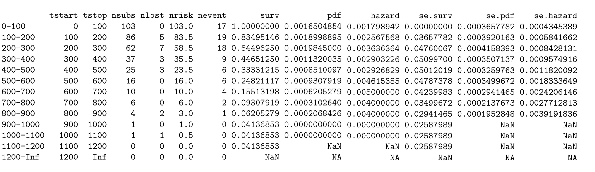
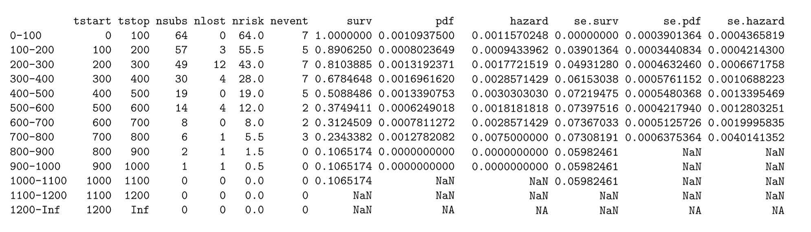
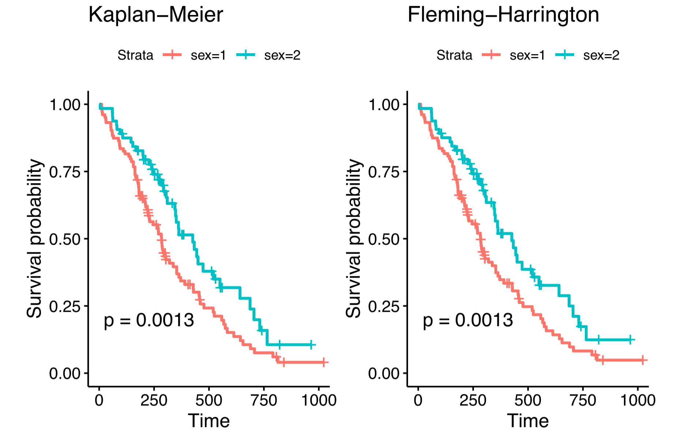

```{r setup, include=FALSE}
library(tidyverse)
library(survival)
library(gtsummary)
library(survminer)

knitr::opts_chunk$set(
  echo = FALSE,
  message = FALSE,
  warning = FALSE)
```

# Introduction

Lung cancer is a disease with a very high prevalence. Prognostic factors provide important information for patients with cancer. A better understanding of patients’ prognosis can help in making appropriate therapeutic decisions[1]. Driven by the desire to improve life quality of lung cancer patients, we perform a survival analysis of these patients and analyze factors that affect survival time.

The dataset we use is the lung cancer dataset in ‘survival’ package in R. The data describes survival of patients with advanced lung cancer from the North Central Cancer Treatment Group, as well as measures of the patients performance assessed either by the physician and by the patients themselves[1]. Our project aims to explore whether factors such as age, sex, and caloric intake, will bring significant differences in the survival rate of patients with advanced lung cancer. The association between both the physician’s assessments of performance status as well as the patient’s assessment of their own performance status and the survival rate are also evaluated.

Methods we use in this project include exploratory data analysis, non-parametric estimate, hypothesis testing, semi-parametric model and parametric models. Details of those methods are given below.

# Methods

## Exploratory Data Analysis

The dataset contains a total of 228 patients and 10 variables. A brief description of variables in the dataset is shown below.

* inst:	Institution code
* time:	Survival time in days
* status:	Censoring status(1=censored, 2=dead)
* age:	Age in years
* sex:	Male=1, Female=2
* ph.ecog:	ECOG performance score (0=good 5=dead)
* ph.karno:	Karnofsky performance score (from bad=0 to good=100) rated by physician
* pat.karno:	Karnofsky performance score as rated by patient
* meal.cal:	Calories consumed at meals
* wt.loss:	Weight loss in last six months

Survival endpoint is the death of patients. The type of censoring is right censoring, which means patients left the study before their death. Among 228 patients, 63 of them were right censored and the number of events was 165. We group the patients by their survival status and provide the descriptive statistics of other variables. Wilcoxon rank sum test, Pearson's Chi-squared test, and Fisher's exact test were used to compare values across group. 

```{r}
data <- lung


data$status <- factor(data$status,
                      levels = c(1,2),
                      labels = c("Alive", "Death"))
data$sex <- factor(data$sex,
                   levels = c(1,2),
                   labels = c("Male", "Female"))
data$ph.ecog <- factor(data$ph.ecog,
                       levels = c(0,1,2,3,4),
                       labels = c("Asymptomatic", 
                                  "Symptomatic but completely ambulatory",
                                  "In bed <50% of the day",
                                  "In bed > 50% of the day but not bedbound",
                                  "Bedbound"))
data$ph.karno <- factor(data$ph.karno,
                       levels = c(50,60,70,80,90,100))
data$pat.karno <- factor(data$pat.karno,
                         levels = c(30,40,50,60,70,80,90,100))


data %>% 
  select(-1) %>%
  tbl_summary(by = status,
              statistic = list(all_continuous() ~ "{mean} ({sd})",
                               all_categorical() ~  "{n} ({p}%)"),
              label = list(time ~ "Survival Time (days)", 
                           age~"Age",
                           sex~"Sex",
                           ph.ecog~ "ECOG Score",
                           ph.karno~"Karnofsky Score(by physician)",
                           pat.karno~"Karnofsky Score(by patients)",
                           meal.cal~"Calories Consumed (kcals)",
                           wt.loss~"Weight Loss (pounds)"),
              missing_text = "Missing") %>% 
  add_p(list(all_categorical() ~ "fisher.test"),
    test.args = pat.karno ~ list(workspace=2e9)) %>%
  add_overall() %>%
  modify_header(label ~ "**Variable**") %>%
  modify_caption("**Patient Characteristics**") %>%
  bold_labels()
```

From the table, we can see that average survival time for censored and dead patients is 363 days and 283 days, respectively. From the p values, we can see that for patients who were alive and dead, the survival time, sex proportion, ECOG performance score and Karnofsky performance score rated by patient are significantly different. However, there are no significant differences in age, Karnofsky performance score rated by physician, calories consumed, and weight loss. (Note that the p values for all continuous variables are obtained from Wilcoxon rank sum tests while Fisher's exact tests for the categorical.)

From the table we can see that there are some missing values in this dataset. For simplicity, we removed those missing data for the following analysis.


## Non-parametric Estimate

**Lifetable** The lifetable was constructed using standard life table methodology[2]. Table 1 represents the lifetable with the time break of 100 days stratified by sex.The full table was in supplementary material. Based on the lifetable, the 50\% survival time of male is between 285 to 286 days versus 433-434 for female. Male has lower survival time than female based on lifetable. The hypothesis need future testify in the following modeling fitting.

<center>


</center>

<center>



</center>

**The Kaplan-Meier and Fleming-Harrington model** For nonparametric estimator, Kaplan-Meier (KM) model and Fleming-Harrington (FH) model were used to measure the fraction of subjects living for a certain amount of time after treatment with the stratify of sex[3].  

  * The Kaplan-Meier estimator

$$ 
\hat S_K(t)= \begin{cases}
1 & \text { if } t< t_1  \\ 
\prod_{t_i \le t} [1-\frac{d_i}{n_i}] & \text { if }   t \ge t_1
\end{cases}
$$

note: $d_i = \# \ of\ failure \ at \ time\ t_i$, $n_i = \#\ at\ risk \ at \  t_i^-$,  $c_i = \# \ censored\ during\ the\ interval\ [t_i, t_{i+1}]$  

  * The Fleming-Harrington estimator

$$ 
\hat S_F(t)= \begin{cases}
1 & \text { if } t< t_1  \\ 
\prod_{t_i \le t} exp[-\frac{d_i}{n_i}] & \text { if }   t \ge t_1
\end{cases}
$$
Both the KM estimator and the FH estimator have P-values that are lower than 0.05. We have 95\% confidence that there are differences between the survival curves over the male and female. According to the following graph(Figure 1), male have a lesser chance of living through the 3 years than female. The difference between sex is more significant in the early time point than the later time point. 

<center>



The KM and FH model have similar trend with no significant difference. FH has slight higher estimator in the late time point than KM estimator. (Figure 2).


## Hypothesis Testing


## Semi-parametric Model (PH model)


### Variable Selection and Stratification

### Model Checking  

The Cox proportional hazards (PH) model makes two major assumptions. One of them is that the hazard functions for the survival curves of different strata will be proportional over the period of time, while the other one is the relationship between the log of hazard $h(t)$ and every covariate will be linear. We omit the details for the latter assumption here and focus more on the first one in this project as the proportional hazards assumption is significant in terms of the interpretations. The following introduces some graphical methods, the interaction test, and residuals checking.

**Graphical Approach** One of the most popular strategies for PH assumption checking is to compare the survival curves visually. Recall for a PH model, $S(t|Z = z) = e^{-\int h_0(t)e^{\beta z}dt} = S_0(t)^{e^{\beta z}}$. By using a log-log transformation (i.e., $log\{-logS(t|Z = z)\}$), we will have $$log\{-log\hat{S}(t|Z = z)\} - log\{-log\hat{S}_0(t)\} = \beta,$$ where $Z \in \{0, 1\}$ is an indicator variable, e.g., sex. Such equation implies the two curves will be paralleled if the proportional assumption holds. Figure 4 shows the transformed survival functions estimated by the K-M estimator along with the log of time. The other simple way is to compare the differences between the observed and fitted survival functions as the Figure 5 shown. 

```{r, fig.align='center', fig.dim = c(6, 8), fig.cap=c("Log of Negative Log of Estimated Survival Functions", "Observed vs. Fitted")}
# --- Graphical method ---
# import data
dat_lung_raw <- survival::lung
dat_lung <- dat_lung_raw %>% 
  mutate_at(c(1, 3, 5, 6), .funs = ~as.factor(.)) %>% na.omit()

# for sex
fit_km_sex <- survfit(Surv(time, status == 2) ~ sex, dat_lung)

# loglog vs. log time
x_ticks <- c(5, 10, 20, 50, 100, 200, 500, 1000)
log_x <- round(log(x_ticks), 1)

par(mfrow = c(2, 1))
plot(fit_km_sex, fun = "cloglog", col = c("black", "red"), xaxt = "none",
     xlab = "log (Time in Days)", ylab = "log{-log(S(t))}")
axis(1, x_ticks, log_x)
legend("topleft", legend = c("Male", "Female"), col = c("black", "red"),
       lty = 1, cex = 1)

# observed vs. fitted
fit_ph_sex <- coxph(Surv(time, status == 2) ~ sex, dat_lung)

plot(fit_km_sex, col = c("blue", "darkgreen"),
     xlab = "Time (Days)", ylab = "Survival Function")
lines(survfit(fit_ph_sex, newdata = data.frame(sex = as.factor(1))), # male
      col = "red", conf.int = FALSE)
lines(survfit(fit_ph_sex, newdata = data.frame(sex = as.factor(2))), # female
      col = "black", conf.int = FALSE)
legend("topright", legend = c("Observed Male", "Observed Female", "Fitted Male", "Fitted Female"),
       col = c("blue", "darkgreen", "red", "black", lty = 1, cex = 1))
```

The above figures demonstrate that the proportional hazards assumption is hold given there is only one indicator variable `sex` in the model.

**Residuals & Interaction Test** XXX

```{r, results='hide', fig.dim=c(6, 8)}
# --- residuals & interaction test ---
# residuals
fit_ph_1 <- coxph(Surv(time, status == 2) ~ sex + meal.cal + wt.loss, dat_lung)
test_ph <- cox.zph(fit_ph_1)
survminer::ggcoxzph(test_ph, ggtheme = theme_classic())

# interaction
fit_ph_2 <- coxph(Surv(time, status == 2) ~ sex + meal.cal + wt.loss +
                    sex * time + meal.cal * time + wt.loss * time,
                  dat_lung)
summary(fit_ph_2)
```

From the above figures, the p values for both variables `sex` and `wt.loss` are greater than 0.05 except the variable `meal.cal`, which means that the proportional hazard assumptions is violated only for `meal.cal`. This result is not consistent with the interaction test where the assumption is retained for all three variables (P>0.05). XXX recommended a two-step procedure for PH assumption assessment where calculating the 


## Parametric Models


# Conclusion


# Discussion


\newpage
# Reference {-}

[1] Loprinzi CL. Laurie JA. Wieand HS. Krook JE. Novotny PJ. Kugler JW. Bartel J. Law M. Bateman M. Klatt NE. et al. Prospective evaluation of prognostic variables from patient-completed questionnaires. North Central Cancer Treatment Group. _Journal of Clinical Oncology_. 12(3):601-7, 1994.

[2] Preston SH, Heuveline P, Guillot M. Demography: measuring and modeling population processes. Blackwell Publishers, 2001.


[3] Goel, M. K., Khanna, P., & Kishore, J. (2010). Understanding survival analysis: Kaplan-Meier estimate. International journal of Ayurveda research, 1(4), 274.


# Appendix {-}
For codes please click [$\textcolor{blue}{here}$](https://github.com/Wu00000/P8108_final_project_G5.git).
